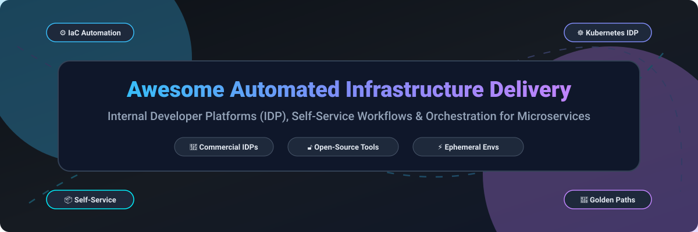

# Awesome-Automated-Infrastructure-Delivery-For-Microservices

# Awesome-Automated-Infrastructure-Delivery-For-Microservices 🏗️ 🚀

  

  
  
  
  
  
  

---

## 🌟 Top Automated Infrastructure Delivery For Microservices Ecosystem

**Curated List of Commercial Internal Developer Platforms & Open-Source Platform Engineering Tools**  
*Focused on Self-Service Infrastructure, Golden Paths, Environment Management & Self-Hosted Developer Platforms*  

**Last updated: October 2026** 📅

---

### 📌 Overview & SEO Summary
Welcome to the ultimate curated directory of **automated infrastructure delivery platforms**, **Internal Developer Platforms (IDPs)**, and **open-source platform engineering frameworks**. Whether you are looking for enterprise-grade commercial solutions (such as *Humanitec*, *Port*, *Qovery*, and *Cycloid*), or self-hostable open-source alternatives (like *OpenChoreo*, *Backstage*, and *KubeVela*), this list covers category leaders, platform orchestrators, and privacy-respecting developer portals.

---

## 📑 Table of Contents
- [🏢 SaaS & Commercial Platforms](#-saas--commercial-platforms)
- [🔓 Open-Source GitHub Projects](#-open-source-github-projects)
- [🛠️ How to Contribute](#%EF%B8%8F-how-to-contribute)
- [📊 Star History](#-star-history)
- [🤝 Support & Sponsorship](#-support--sponsorship)
- [⚠️ Disclaimer](#%EF%B8%8F-disclaimer)

---

## 🏢 SaaS / Commercial Platforms

The Internal Developer Platform market has consolidated around a handful of platform orchestrators that abstract infrastructure complexity for development teams. Pricing models vary significantly: Humanitec charges per user plus a platform fee , Cycloid starts at $39/user/month for end-users with a $2,500/year entry setup fee , Qovery's Business tier starts at $2,999/month for 20 users , Bunnyshell uses pay-per-minute environment billing ($0.007/min/env) , ReleaseHub has a free tier with a median paid contract of $140,000/year , and AWS Proton itself is free but the underlying provisioned infrastructure can easily add $50,000–$200,000/month in unmanaged costs without governance [citation:1].

| SaaS / Commercial Platform | Company / Owner | Valuation / Market Cap | Standard Edition Starting Price | Free Tier / Free Trial Limits | Description |
| :--- | :--- | :--- | :--- | :--- | :--- |
| **[AWS Proton](https://aws.amazon.com/proton/)** ☁️ | Amazon | ~$2.0 Trillion | **Free platform**; underlying infrastructure billed normally | No platform fee; pay-as-you-go for provisioned resources | **AWS-native self-service infrastructure** — Standardizes infrastructure provisioning across containers and serverless. Templates encode infrastructure defaults that replicate across every environment. **Hidden cost warning**: per-environment NAT Gateways ($36/month idle), multi-AZ RDS on dev, and stale environments can add $50K–$200K/month without governance [citation:1]. |
| **[Humanitec](https://humanitec.com/)** 🎯 | Humanitec | Private | Custom enterprise pricing (per user) | No free tier; trial available | **Platform Orchestrator** — Core of an Internal Developer Platform. Development teams describe app architecture and infrastructure declaratively; Humanitec configures and deploys workloads while orchestrating required infrastructure. Enables golden paths and reusable templates [citation:2]. |
| **[Port](https://www.port.io/)** 🏢 | Port | Private | Custom enterprise pricing | Free trial available | **No-code Internal Developer Portal** — Build a developer portal and IDP without writing code. Service catalog, self-service actions, scorecards, and RBAC. Integrates with existing tooling (Kubernetes, Terraform, CI/CD). |
| **[Mia-Platform](https://mia-platform.eu/)** 🇮🇹 | Mia-Platform | Private | Contact vendor for pricing | Free trial available | **End-to-end platform builder** — Italian platform engineering company. Designs, builds, and runs cloud-native platforms for enterprises. Focus on regulated industries and API-first architecture [citation:4]. |
| **[Qovery](https://www.qovery.com/)** 🚀 | Qovery | Private | Business: **$2,999/month** (20 users); Enterprise: custom annual | **14-day free trial**; no permanent free tier | **Bring Your Own Cloud (BYOC) platform** — Git-push deployments and preview environments on your own AWS, GCP, Azure, or Scaleway account. Keeps cloud discounts and data residency. Business includes 10,000 deployment minutes and 3 managed clusters. Enterprise adds self-hosted control plane (air-gapped) and compliance packages [citation:5]. |
| **[Cycloid](https://www.cycloid.io/)** ⚙️ | Cycloid | Private | End-users: **$39/user/month**; Platform Teams: $65/user/month | No permanent free tier; $2,500/year entry setup fee | **Platform engineering platform** — Breaks down team silos and supports hybrid cloud journey. Infra Import industrializes manually deployed infrastructure into IaC. Three pricing models: subscription, cloud consumption, and cloud reselling (Cycloid free of charge) [citation:2][citation:6]. |
| **[Shipa](https://www.shipa.io/)** 🚢 | Shipa | Private | Custom enterprise pricing | No free tier | **Application-centric deployment framework** — Standardized application and policy definitions that work across any infrastructure. Simplifies deploying, securing, and managing apps across cloud-native infrastructures [citation:7]. |
| **[ReleaseHub](https://release.com/)** 📦 | ReleaseHub | Private | Free tier available; **median paid contract $140,000/year** | **Free tier** for small pre-production workloads | **Ephemeral environment platform** — Solves the cost and complexity of creating, managing, and maintaining environments for developers. Enterprise plans include SLAs and annual agreements [citation:8]. |
| **[HashiCorp Waypoint](https://www.waypointproject.io/)** 🛤️ | HashiCorp (IBM) | ~$5 Billion (Acquired by IBM) | Community Edition free (no longer maintained); HCP Waypoint: consumption-based | **Community Edition legacy (v0.11.4)**; HCP Waypoint pay-as-you-go | **Application deployment workflow** — Consistent build, deploy, and release workflow regardless of target platform (Docker, Kubernetes, AWS ECS, bare metal). **Community Edition no longer actively maintained**; HashiCorp's current offering is HCP Waypoint [citation:9]. |
| **[Bunnyshell](https://www.bunnyshell.com/)** 🐰 | Bunnyshell | Private | Startup: **$0.007/min per env** (pay-as-you-go); Scaleup: custom | **14-day full-feature trial**; no credit card required | **Ephemeral environments for microservices** — Every PR gets its own environment. Sandbox AI Environments, modern CI/CD, bring your own cloud. Billing stops when environment is stopped or deleted [citation:10]. |

---

## 🔓 Open-Source GitHub Projects

*Sorted by GitHub_Stars_Count (Descending)* 🌟

- **[Backstage](https://github.com/backstage/backstage)**   
  **The most widely adopted open-source developer portal**, Apache-2.0 licensed. ~28k+ stars. Created by Spotify, now CNCF graduated. Service catalog, software templates (golden paths), TechDocs, and plugin ecosystem with 200+ integrations. The foundation for many commercial IDPs.  🎭

- **[OpenChoreo](https://github.com/openchoreo/openchoreo)**   
  **Complete, modular open-source developer platform**, Apache-2.0 licensed. Built with Kubernetes-native abstractions: Projects (Bounded Contexts), Components, Endpoints, and Connections. **Zero-trust security by default** with Cilium/eBPF and mTLS on all intra-cell communication. Built-in ingress/egress API management via kgateways. Observability instrumented by default. Platform team defines rules; app teams work within boundaries. Developer experience hides infrastructure complexity [citation:11].  🎯

- **[KubeVela](https://github.com/oam-dev/kubevela)**   
  **Modern application delivery platform**, Apache-2.0 licensed. ~6k+ stars. Built on Open Application Model (OAM). Creates cloud resources using Kubernetes custom resources. Enables platform teams to define abstractions while developers deploy applications without YAML. CNCF sandbox project.  🎨

- **[Crossplane](https://github.com/crossplane/crossplane)**   
  **Control plane framework using Kubernetes custom resources**, Apache-2.0 licensed. ~10k+ stars. Manages cloud infrastructure (AWS, Azure, GCP) as Kubernetes resources. Enables platform teams to define composite resources that abstract complex infrastructure. CNCF graduated project.  ⚡

- **[Dokku](https://github.com/dokku/dokku)**   
  **Open source PaaS alternative to Heroku**, MIT licensed. ~28k+ stars. Git-push deployments on a single VM. Simplest self-hosted platform for small teams. Supports Dockerfile and Buildpack deployments.  🐳

- **[Coolify](https://github.com/coollabsio/coolify)**   
  **Self-hostable Heroku/Netlify alternative**, Apache-2.0 licensed. ~15k+ stars. Manages servers, applications, and databases from a single interface. Git-based deployments, preview environments, and one-click services.  ❄️

- **[Portainer](https://github.com/portainer/portainer)**   
  **Container management for Kubernetes and Docker**, zlib licensed. ~30k+ stars. Web-based UI for managing containerized environments. Provides self-service deployment capabilities for development teams.  🖥️

- **[KusionStack](https://github.com/KusionStack/kusion)**   
  **Open tech stack to build Internal Developer Platforms**, Apache-2.0 licensed. ~2k+ stars. Declarative platform configuration with KCL. Enables platform teams to deliver self-service infrastructure and application deployment.  🔧

- **[OAM Kubernetes Runtime](https://github.com/crossplane/oam-kubernetes-runtime)**   
  **Open Application Model runtime for Kubernetes**, Apache-2.0 licensed. ~1.5k+ stars. The foundational runtime that powers KubeVela. Defines application abstractions for platform teams.  📐

- **[DevStream](https://github.com/devstream-io/devstream)**   
  **DevOps toolchain manager**, Apache-2.0 licensed. ~1.5k+ stars. Manages the lifecycle of DevOps tools (GitLab, Jenkins, ArgoCD, etc.) with declarative configuration. Abstracts tool complexity for platform teams.  🌊

- **[Kratix](https://github.com/syntasso/kratix)**   
  **Platform engineering framework**, Apache-2.0 licensed. ~1.5k+ stars. Enables platform teams to deliver "as-a-Service" capabilities on Kubernetes. Promise framework for composable platform APIs.  🏗️

- **[Score](https://github.com/score-spec/score)**   
  **Workload specification for developer-centric platforms**, Apache-2.0 licensed. ~2k+ stars. Declarative specification that describes workload dependencies and resource requirements. Platform-agnostic; implementable on Kubernetes, Docker Compose, or other runtimes.  📝

---

## 🛠️ How to Contribute

Contributions are welcome! Follow these steps to submit new infrastructure delivery platforms or open-source platform engineering software:

1. 🍴 **Fork** the repository.
2. 📝 **Add/edit** entries in `README.md` maintaining table/list structure and formatting.
3. 🔗 Include project title, official website/GitHub link, exact Stars_Count, license, and brief description.
4. 🚀 Submit a **Pull Request** with a descriptive summary of your changes.

---

## 📊 Star History

---

## 🤝 Support & Sponsorship

If you find this infrastructure delivery repository useful, please consider supporting the project:

- ⭐ **Star** this repository to increase visibility!
- 🔀 **Fork** and share with fellow developers, platform engineers, and DevOps leads.
- ☕ **Sponsor & Buy Me a Coffee**: Support ongoing open-source curation via the [GitHub Sponsor Dashboard](https://github.com/sponsors/ishandutta2007).

---

## ⚠️ Disclaimer

- This is a **community-curated** list — not exhaustive and not an endorsement. ℹ️
- Internal Developer Platforms abstract infrastructure complexity but can **inflate cloud costs** if not governed. AWS Proton's self-service provisioning without environment lifecycle policies can add $50K–$200K/month in unmanaged resources [citation:1]. Always pair platform adoption with cost-allocation tagging and teardown automation. 🔒
- Open-source platforms (OpenChoreo, Backstage, KubeVela) provide self-hosted ownership and transparency, but enterprise-grade SLA guarantees, managed control planes, and 24/7 support remain primarily commercial offerings. 🏗️

---

  <b>Made with ❤️ for platform engineers, DevOps leads, and open-source infrastructure advocates.</b>

